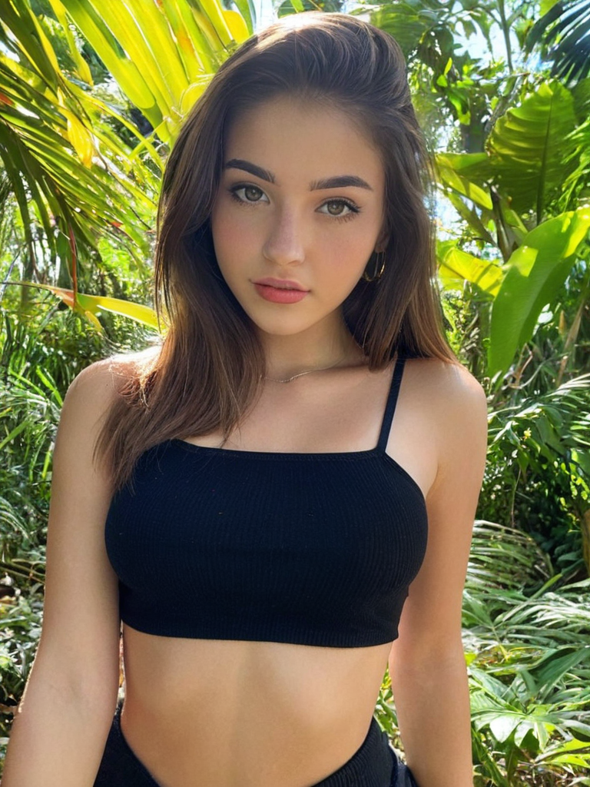
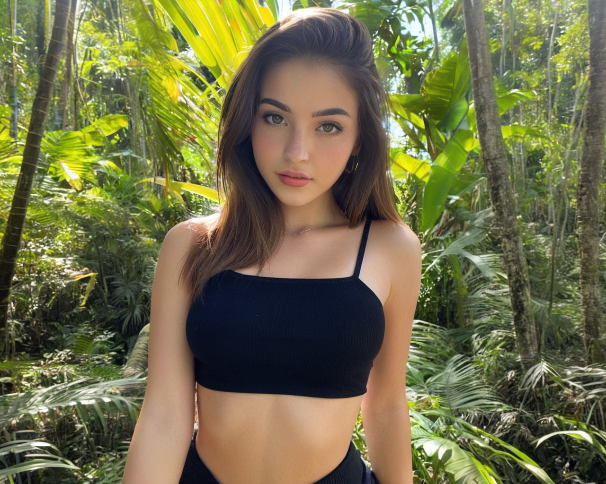

# SoftExtend Pipeline
SoftExtend is a Diffusers pipeline based on Differential Diffusion, incorporating input and preprocessing modifications that enable it to function more like "soft outpainting"—without requiring additional inference steps. A small addition of nondeterministic, stirring the extension blur combined with fluid-like noise fill proves surprisingly effective at guiding the img2img process to produce outpainting results that are less deterministic and are better-blended with the original image. I tested a variety of noise patterns, opacities, edge fades, and other parameters, and found this configuration to yield the best results so far. If I discover an approach that performs better, I’ll update the pipeline’s preprocessing accordingly.

Differential Diffusion is proposed and developed by https://github.com/exx8 <br>
Standard differential img2img pipeline can be found at https://github.com/huggingface/diffusers/blob/main/examples/community/pipeline_stable_diffusion_xl_differential_img2img.py

#### Modifications of DiffDiff:
- Accepts an "image" and "mask" in PIL format.
- The "extend_sides=[top, right, bottom, left]" parameter determined how far the image should be extended on each side.
- If the extend_sides parameter is NOT provided, then you must manually extend the image with the extended areas manually painted.
- If the extend_sides parameter IS provided, then you do not need to manually extend the image, and the mask will also be created automatically.
- There are essentially 2 workflows... 1. Simply provide an image and provide the extend_sides parameter, or 2. Provide a manually extended+painted image and a manually created mask.
- If you are manually creating a mask, the mask should be a standard blurred mask, where white areas represent the inpaint area.
- If you are manually extending the image, then the extend_sides parameter should not be provided, and the extension areas should be painted.
- The pipeline preprocesses the image to generate a randomly warped perlin noise in the extension area and pastes that noise onto the image.
- The pipeline creates a mask to cover the stirred noisy extension area and blends with the original image by overflowing slightly.

#### Additional Notes:
- Experiment with different "strength" values from 0.6 to 1.0, gradually increasing the strength until the noise is no longer visible. Increasing strength can also produce a more saturated/contrasted result. But generally, the lowest possible strength is ideal.

## Test the Pipeline

1. **Copy Structure:**
```
└── 📁any-folder
    └── pipeline_stable_diffusion_xl_softextend.py
    └── test_softextend.py
    └── setup.sh
    └── any-sdxl-model.safetensors
    └── image.png
    └── mask.png # If needed... This pipeline will automatically create the mask and extend the image if "extend_sides" is provided.
```

2. **Run the Setup file:**
```bash
bash setup.sh
```
Note: You may need to use "python3" instead of "python" in 'setup.sh'.

3. **Add Model to 'test_softextend.py':**
```python
pipeline = StableDiffusionXLSoftExtendPipeline.from_single_file(
--> "any-sdxl-model.safetensors", <--
    torch_dtype=torch_dtype,
    use_safetensors=True,
).to(device)
```

4. **Add your Prompt in 'test_softextend.py':**
```python
prompt = "describe what you want to see in the masked area"
negative_prompt = "describe what you do NOT want to see in the masked area"
```
Note: Only describe within masked area.

5. **Activate your Virtual Environment':**
```bash
source .venv/bin/activate
```

7. **Run the 'test_softextend.py':**
```bash
python test_softextend.py
```

## Example Image Process
**Model Used:** https://civitai.com/models/277058?modelVersionId=1522905 <br>
**prompt=** photo portrait of beautiful tropical jungle with sunlight filtering through foliage in the background <br>
**negative_prompt=** lowres, bad quality, worst quality, (closeup leaves)++, (large plants)++, blurry, bokeh <br>
**num_inference_steps=** 50 <br>
**guidance_scale=** 3, <br>
**strength=** 0.85, <br>
**image=** image, <br>
**mask=** None, <br>
**extend_sides=** [0, 256, 0, 256], <br>

| Image | Result |
|--------------|---------------|
|  |  |
